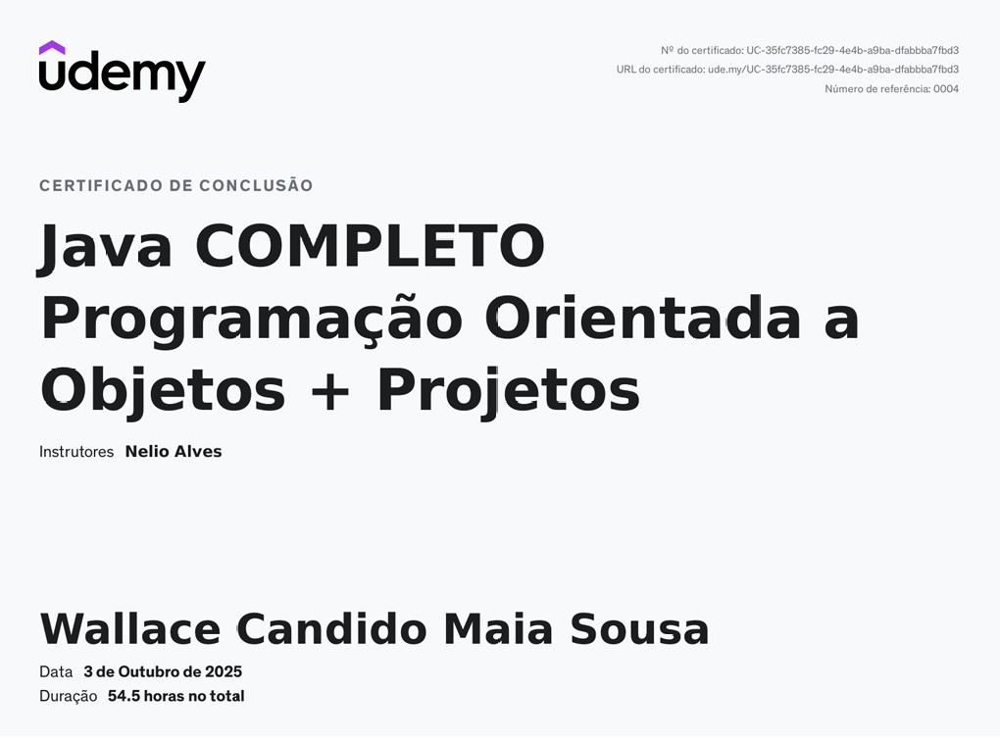

# 📝 Post System - Sistema de Posts com MongoDB

Sistema de gerenciamento de posts, comentários e usuários desenvolvido com Spring Boot 3.5 e MongoDB, aplicando conceitos de arquitetura em camadas, DTOs, tratamento de exceções e NoSQL.

## 🚀 Sobre o Projeto

Este projeto é uma evolução de um sistema de posts baseado no curso de POO com Spring do professor Nelio Alves (Udemy). A versão original utilizava Spring Boot 1.5.x, mas esta implementação foi modernizada para:

- **Spring Boot 3.5.6**
- **Java 21** (com Records)
- **MongoDB** como banco de dados NoSQL
- Aplicação de boas práticas aprendidas em outros projetos (como Digital Bank API)
- **CRUD completo** para Posts e Users

## 📌 Objetivo

Demonstrar a integração entre Spring Boot e MongoDB, utilizando relacionamentos entre documentos, queries customizadas, operações CRUD completas e uma arquitetura robusta de camadas.

## 🛠️ Tecnologias Utilizadas

| Tecnologia | Versão | Descrição |
|------------|--------|-----------|
| Java | 21 | Linguagem de programação com recursos modernos (Records, Pattern Matching) |
| Spring Boot | 3.5.6 | Framework para desenvolvimento de aplicações Java |
| Spring Data MongoDB | 3.5.6 | Integração com MongoDB através de repositórios |
| MongoDB | Latest | Banco de dados NoSQL orientado a documentos |
| Maven | 3.9.11 | Gerenciador de dependências |

## 📂 Estrutura do Projeto

```
src/main/java/com/wallace/spring/boot/
│
├── application/
│   └── Main.java                    
│
├── domain/
│   ├── controller/               
│   │   ├── GlobalExceptionHandler.java
│   │   ├── PostController.java
│   │   └── UserController.java
│   │
│   ├── dtos/                        
│   │   ├── ErrorResponse.java
│   │   ├── post/
│   │   │   ├── AuthorResponseDTO.java
│   │   │   ├── PostRequestDTO.java
│   │   │   ├── PostResponseDTO.java
│   │   │   └── comment/
│   │   │       └── CommentResponseDTO.java
│   │   └── user/
│   │       ├── UserRequestDTO.java
│   │       └── UserResponseDTO.java
│   │
│   ├── entities/                  
│   │   ├── Comment.java
│   │   ├── Post.java
│   │   └── User.java
│   │
│   ├── repository/                 
│   │   ├── CommentRepository.java
│   │   ├── PostRepository.java
│   │   └── UserRepository.java
│   │
│   ├── services/                   
│   │   ├── PostService.java
│   │   └── UserService.java
│   │
│   └── util/
│       └── URL.java                 
│
└── exceptions/                     
    ├── DomainException.java
    ├── PostNotFoundException.java
    └── UserNotFoundException.java
```

## 🏗️ Arquitetura e Conceitos Aplicados

### 📦 Camadas da Aplicação

**Controller (Apresentação)**
- Expõe endpoints REST
- Recebe requisições HTTP e retorna respostas
- Delega a lógica de negócio para a camada de serviço

**Service (Negócio)**
- Contém as regras de negócio
- Orquestra operações entre repositórios
- Lança exceções de domínio quando necessário

**Repository (Persistência)**
- Interface com o banco de dados MongoDB
- Utiliza Spring Data MongoDB para queries automáticas
- Queries customizadas com métodos derivados

**DTOs (Data Transfer Objects)**
- Objetos imutáveis (Records do Java 21)
- Desacoplam a camada de apresentação do domínio
- Controlam quais dados são expostos na API

### 🔗 Relacionamentos no MongoDB

- **User → Post**: Referência com `@DBRef(lazy = true)`
- **Post → Comment**: Lista embutida (embedded documents)
- **Post/Comment → Author**: DTO embutido para desnormalização

### 🚨 Tratamento de Exceções

- Exceções customizadas com `@ResponseStatus`
- `GlobalExceptionHandler` centraliza o tratamento
- Respostas padronizadas com `ErrorResponse`

## 🔧 Configuração e Execução

### Pré-requisitos

- Java 21+
- Maven 3.9+
- MongoDB rodando na porta 27017

### 1️⃣ Clone o Repositório

```bash
git clone https://github.com/seu-usuario/post-system.git
cd post-system
```

### 2️⃣ Configure o MongoDB

Certifique-se de que o MongoDB está rodando:

```bash
mongod
```

O banco de dados `Workshop_Mongo` será criado automaticamente.

### 3️⃣ Execute a Aplicação

**Linux/Mac:**
```bash
./mvnw spring-boot:run
```

**Windows:**
```bash
mvnw.cmd spring-boot:run
```

A aplicação estará disponível em: `http://localhost:8080`

## 📡 Endpoints da API

### 👥 Users

| Método | Endpoint | Descrição |
|--------|----------|-----------|
| GET | `/users` | Lista todos os usuários |
| GET | `/users/{id}` | Busca usuário por ID |
| GET | `/users/{id}/posts` | Lista posts de um usuário |
| POST | `/users` | Cria novo usuário |
| PUT | `/users/{id}` | Atualiza usuário |
| DELETE | `/users/{id}` | Remove usuário e seus posts |

**Exemplo de Request (POST /users):**
```json
{
  "name": "John Doe",
  "email": "john@example.com"
}
```

**Exemplo de Response:**
```json
{
  "id": "67890abc123",
  "name": "John Doe",
  "email": "john@example.com"
}
```

### 📄 Posts

| Método | Endpoint | Descrição |
|--------|----------|-----------|
| GET | `/posts` | Lista todos os posts |
| GET | `/posts/{id}` | Busca post por ID |
| GET | `/posts/titlesearch?text={texto}` | Busca posts por título |
| POST | `/posts` | Cria novo post |
| PUT | `/posts/{id}` | Atualiza post |
| DELETE | `/posts/{id}` | Remove post |

**Exemplo de Request (POST /posts):**
```json
{
  "title": "Partiu viagem",
  "date": "2024-03-21",
  "description": "Vou viajar para São Paulo. Abraços!",
  "author": {
    "id": "67890abc123",
    "name": "John Doe"
  }
}
```

**Exemplo de Response (GET /posts/{id}):**
```json
{
  "id": "67890",
  "title": "Partiu viagem",
  "date": "2024-03-21",
  "description": "Vou viajar para São Paulo. Abraços!",
  "author": {
    "id": "12345",
    "name": "Maria Brown"
  },
  "comments": [
    {
      "text": "Boa viagem mano!",
      "date": "2024-03-21",
      "authorResponseDTO": {
        "id": "54321",
        "name": "Alex Green"
      }
    }
  ]
}
```

## 🗄️ Modelo de Dados

### User (Documento Principal)
```javascript
{
  "_id": ObjectId,
  "name": String,
  "email": String,
  "posts": [ObjectId]  // Referência (DBRef)
}
```

### Post (Documento Principal)
```javascript
{
  "_id": ObjectId,
  "title": String,
  "date": Date,
  "description": String,
  "author": {         // Embedded
    "id": ObjectId,
    "name": String
  },
  "comments": [       // Embedded Array
    {
      "_id": ObjectId,
      "text": String,
      "date": Date,
      "authorResponseDTO": {
        "id": ObjectId,
        "name": String
      }
    }
  ]
}
```

### Comment (Documento Separado)
```javascript
{
  "_id": ObjectId,
  "text": String,
  "date": Date,
  "authorResponseDTO": {
    "id": ObjectId,
    "name": String
  }
}
```

## 🧪 Testando a API

### Usando cURL

**Listar todos os usuários:**
```bash
curl http://localhost:8080/users
```

**Criar novo usuário:**
```bash
curl -X POST http://localhost:8080/users \
  -H "Content-Type: application/json" \
  -d '{"name":"Alice","email":"alice@example.com"}'
```

**Buscar posts por título:**
```bash
curl "http://localhost:8080/posts/titlesearch?text=viagem"
```

**Criar novo post:**
```bash
curl -X POST http://localhost:8080/posts \
  -H "Content-Type: application/json" \
  -d '{
    "title": "Novo Post",
    "date": "2024-10-03",
    "description": "Descrição do post",
    "author": {
      "id": "ID_DO_USUARIO",
      "name": "Nome do Autor"
    }
  }'
```

**Atualizar usuário:**
```bash
curl -X PUT http://localhost:8080/users/{id} \
  -H "Content-Type: application/json" \
  -d '{"name":"Alice Silva","email":"alice.silva@example.com"}'
```

**Deletar post:**
```bash
curl -X DELETE http://localhost:8080/posts/{id}
```

## 📚 Conceitos de MongoDB Aplicados

- **Documentos Embutidos (Embedded)**: Comments dentro de Posts
- **Referências (DBRef)**: Posts referenciados em Users
- **Desnormalização**: AuthorDTO embutido para performance
- **Queries com Regex**: Busca case-insensitive por título
- **Lazy Loading**: Posts carregados sob demanda no User

## ✨ Funcionalidades Implementadas

✅ CRUD completo de usuários  
✅ CRUD completo de posts  
✅ Busca de posts por título (case-insensitive)  
✅ Listagem de posts por usuário  
✅ Deleção em cascata (ao deletar usuário, deleta seus posts)  
✅ Tratamento centralizado de exceções  
✅ DTOs para desacoplamento  
✅ Relacionamentos complexos no MongoDB  
✅ Seeder de dados iniciais  


## 👨‍💻 Autor

<div align="center">
  
  
  **Wallace Maia**  
  *Desenvolvedor Backend Java/Spring*
  
  [](https://www.linkedin.com/in/wallacemaia-dev/)
  [](https://github.com/wallacemaia2007)
  [](mailto:wallacemaia2007@gmail.com)
</div>

---

## 📜 Certificação

Este projeto foi desenvolvido e evoluído a partir do curso  
**"Java COMPLETO: Programação Orientada a Objetos + Projetos"** do professor Nelio Alves (Udemy).  

### Certificado
[](./certificado.pdf)

